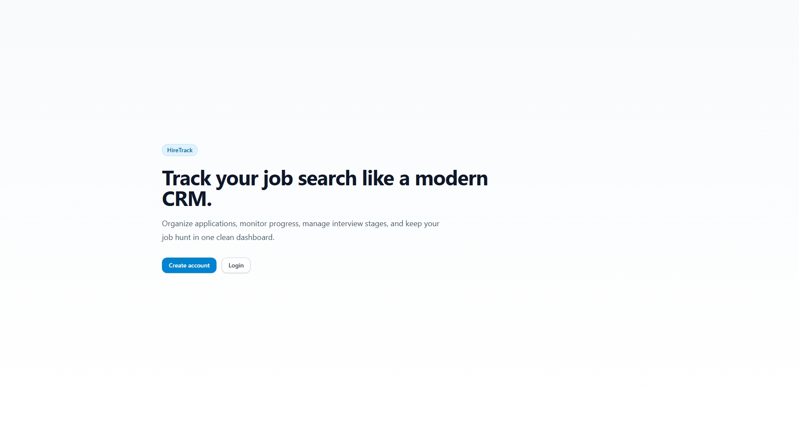
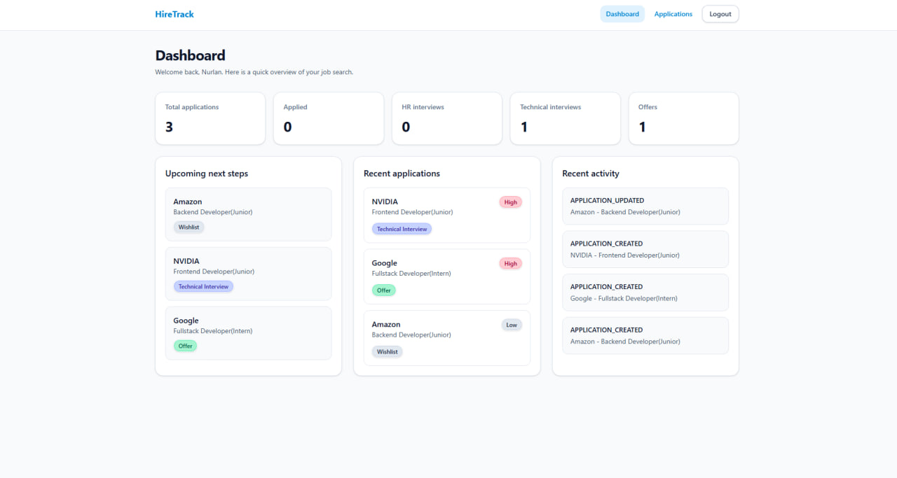
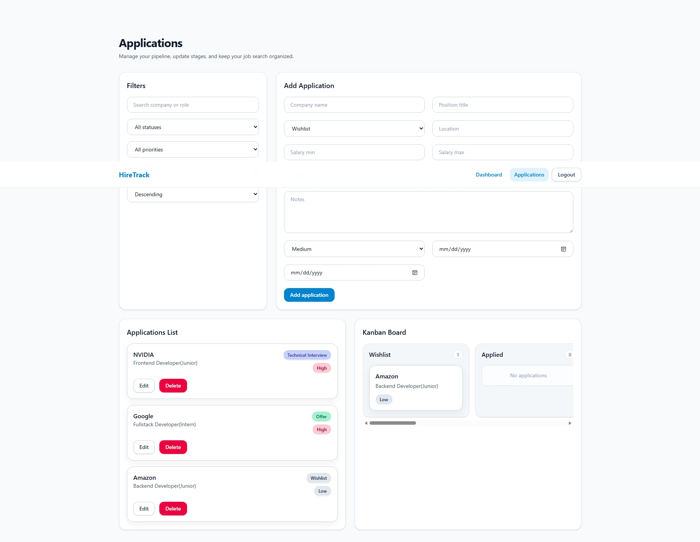

# HireTrack

HireTrack is a fullstack job application CRM built to help users manage their job search in a structured and professional way.  
It allows users to track applications, update statuses, manage priorities, view analytics, and monitor recent activity in one dashboard.

## Features

- User authentication with JWT
- Protected routes
- Create, edit, delete, and view job applications
- Track application stages:
  - Wishlist
  - Applied
  - HR Interview
  - Technical Interview
  - Test Task
  - Final Interview
  - Offer
  - Rejected
- Search, filter, and sort applications
- Dashboard statistics
- Recent activity log
- Kanban board by application stage
- Responsive and modern UI with Tailwind CSS

## Tech Stack

### Frontend

- React
- React Router
- Axios
- Tailwind CSS
- Vite

### Backend

- Node.js
- Express
- Prisma ORM
- JWT Authentication
- bcryptjs

### Database

- MySQL

## Project Structure

```bash
hiretrack/
  backend/
  frontend/
```

# HireTrack

HireTrack is a fullstack job application CRM built to help users manage their job search in a structured and professional way.  
It allows users to track applications, update statuses, manage priorities, view analytics, and monitor recent activity in one dashboard.

## Features

- User authentication with JWT
- Protected routes
- Create, edit, delete, and view job applications
- Track application stages:
  - Wishlist
  - Applied
  - HR Interview
  - Technical Interview
  - Test Task
  - Final Interview
  - Offer
  - Rejected
- Search, filter, and sort applications
- Dashboard statistics
- Recent activity log
- Kanban board by application stage
- Responsive and modern UI with Tailwind CSS

## Tech Stack

### Frontend

- React
- React Router
- Axios
- Tailwind CSS
- Vite

### Backend

- Node.js
- Express
- Prisma ORM
- JWT Authentication
- bcryptjs

### Database

- MySQL

## Project Structure

```bash
hiretrack/
  backend/
  frontend/
```

## Screenshots

### Home



### Dashboard



### Applications


